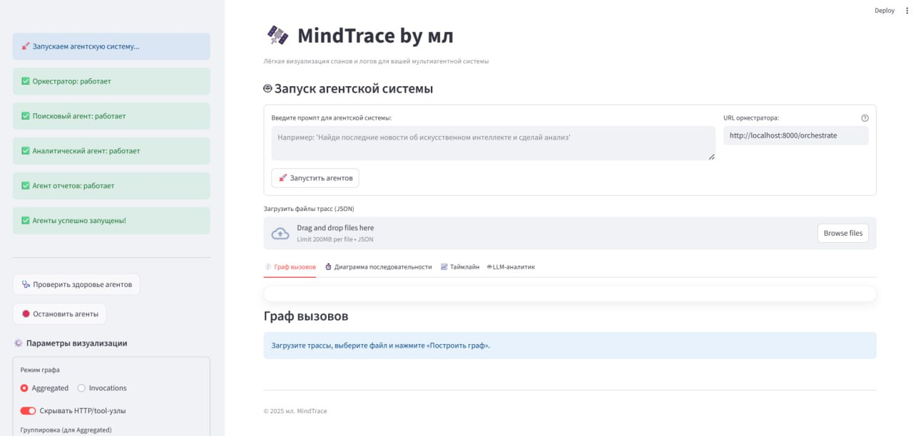
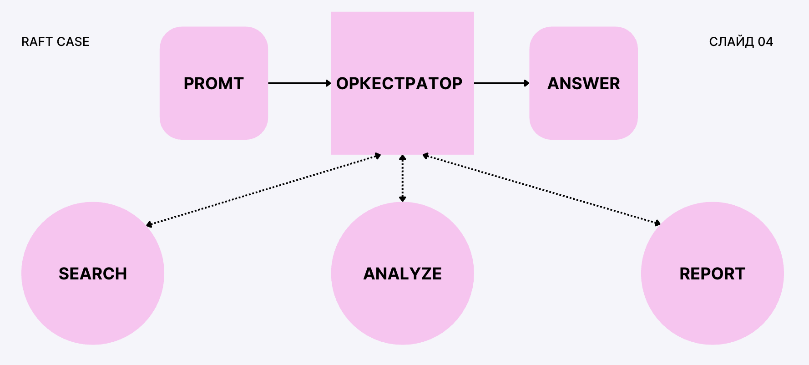
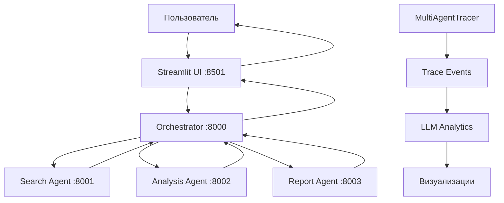
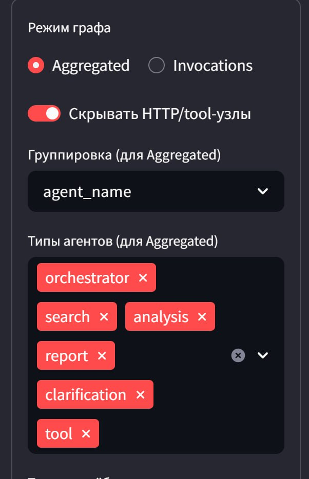
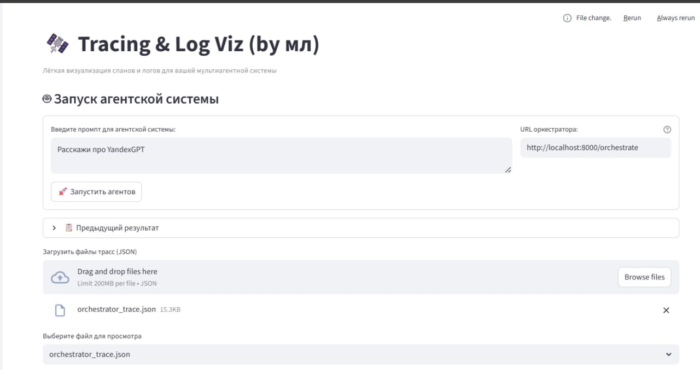
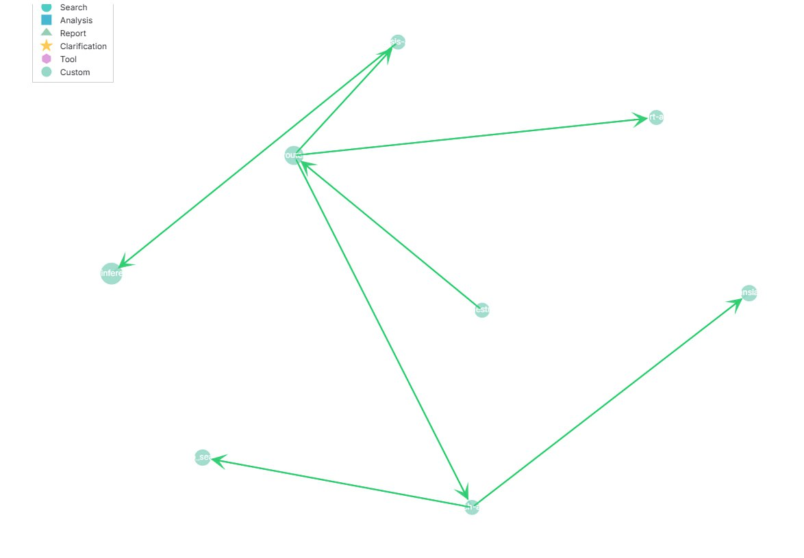
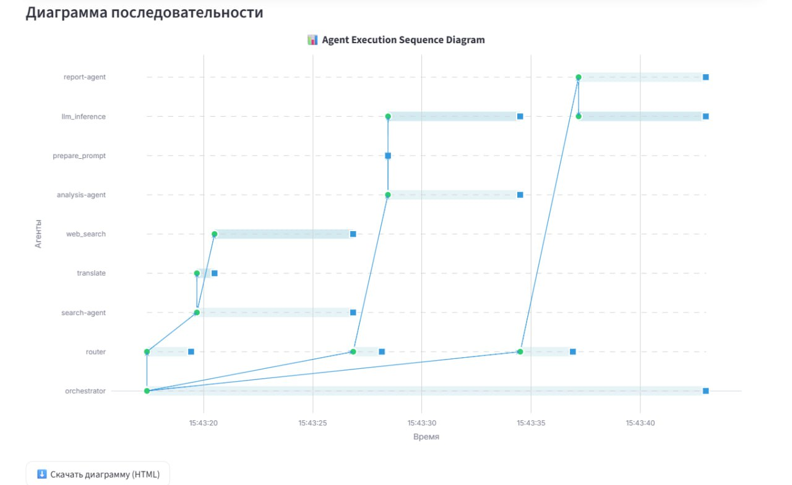
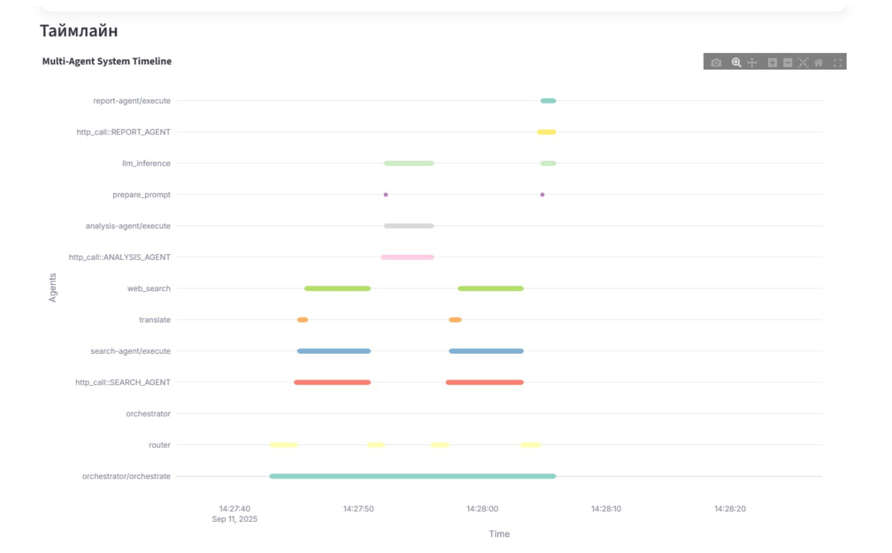
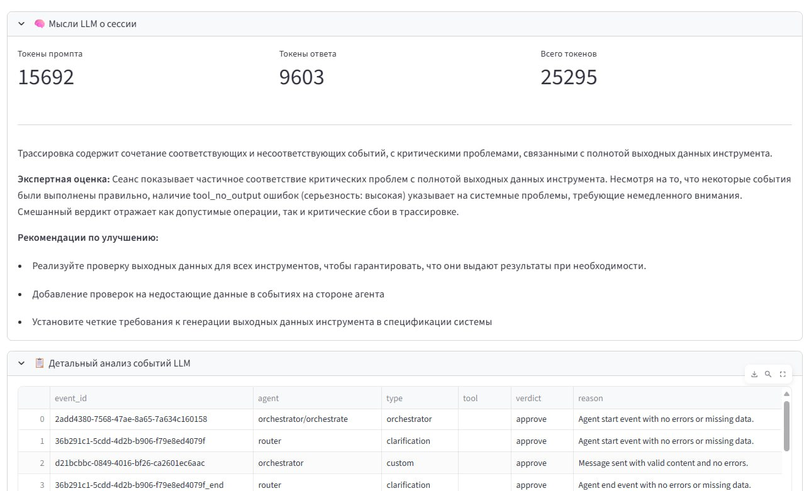
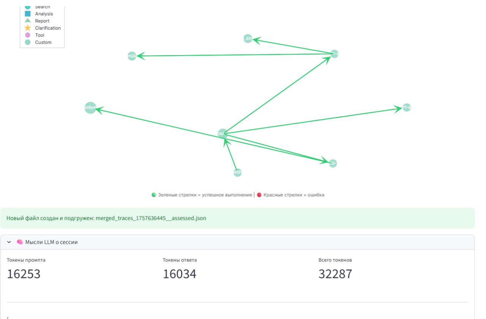

# MindTrace — мультиагентная система с трассировкой и LLM-аналитикой

> *Интерактивная среда для запуска мультиагентной системы с полной трассировкой взаимодействий*

**MindTrace** — это комплексная система для исследования и анализа работы мультиагентных систем. Проект предоставляет веб-интерфейс на Streamlit для управления агентами, сбора детальных трасс их взаимодействий и проведения LLM-анализа производительности системы.



##  Ключевые возможности

-  **Мультиагентная архитектура**: Оркестратор + 3 специализированных агента (поиск, анализ, отчеты)
-  **Детальная трассировка**: Сбор всех событий с временными метками и иерархией вызовов
-  **Интерактивная визуализация**: Графы вызовов, sequence диаграммы, timeline
-  **LLM-аналитика**: Автоматический анализ трасс с классификацией и рекомендациями
-  **Web UI**: Удобный интерфейс для управления и мониторинга системы
-  **Real-time мониторинг**: Проверка здоровья агентов и управление жизненным циклом

##  Структура проекта

```
.
├─ agent_with_orchestrator.py   # FastAPI-приложения: оркестратор + агенты (search, analysis, report)
├─ custom_trace.py              # Примеры/утилиты трассировки (обертки для tracer)
├─ llm_analytics.py             # Аналитика трасс: чанкинг, вызов LLM, офлайн-фолбэк
├─ streamlit_app.py             # Веб-UI: подъем агентов, отправка промптов, визуализации, LLM-анализ
├─ app.py                       # Утилита запуска Streamlit на фиксированном порту
└─ multiagent_tracer/
   └─ multiagent_tracer.py      # Класс MultiAgentTracer: сбор событий, rebuild графа, граф/sequence/timeline
└─ notebooks/
   └─ ai_product_agent.ipynb       # Ноутбук для тестирования и отладки
```

*Streamlit-приложение поднимает сам оркестратор и агентов в фоновом режиме через `uvicorn`.*

---

##  Быстрый старт

### Требования

- **Python 3.8+**
- **Свободные порты**: 8000-8003 (для агентов), 8501 (для Streamlit)
- **Опционально**: API ключи для OpenAI/OpenRouter (для LLM-аналитики)

###  Установка

#### 1. Клонирование и настройка окружения

```bash
# Клонируйте репозиторий
git clone <repository-url>
cd ai_product_hack

# Создайте виртуальное окружение
python -m venv .venv

# Активируйте окружение
# Windows:
.\.venv\Scripts\activate
# macOS/Linux:
source .venv/bin/activate
```

#### 2. Установка зависимостей

```bash
# Установка из requirements.txt (рекомендуется)
pip install -r requirements.txt

# Или ручная установка основных пакетов
pip install -U fastapi uvicorn requests aiohttp streamlit pandas plotly networkx matplotlib python-dotenv
pip install -U langchain-openai langchain-core jsonschema duckduckgo-search
```

#### 3. Настройка переменных окружения

Создайте файл `.env` в корневой директории проекта:

```env
# =============================================================================
# LLM АНАЛИТИКА (опционально)
# =============================================================================

# Вариант 1: OpenAI
OPENAI_API_KEY=sk-...

# Вариант 2: OpenRouter (более доступные модели)
OPENROUTER_API_KEY=sk-or-v1-...
LLM_BASE_URL=https://openrouter.ai/api/v1
LLM_MODEL=openai/gpt-4o-mini

# =============================================================================
# YANDEX GPT (если используется)
# =============================================================================
FOLDER_ID=your-yandex-folder-id
API_KEY=your-yandex-api-key
```

>  **Примечание**: Без API ключей система будет работать в офлайн-режиме для LLM-аналитики

#### 4. Запуск системы

```bash
# Запуск веб-интерфейса (автоматически поднимет все агенты)
python -m streamlit run streamlit_app.py
```

После запуска:
- Откройте браузер по адресу: `http://localhost:8501`
- Дождитесь зеленых статусов всех агентов в боковой панели
- Начинайте работу! 

###  Проверка установки

```bash
# Проверьте доступность агентов
curl http://localhost:8000/health  # Orchestrator
curl http://localhost:8001/health  # Search Agent
curl http://localhost:8002/health  # Analysis Agent  
curl http://localhost:8003/health  # Report Agent
```

Все эндпоинты должны вернуть `{"status": "healthy"}`

Скрипт `streamlit_app.py` стартует Streamlit на порту `8501`. Логи пишутся в `streamlit.log`.

При старте страницы Streamlit-приложение автоматически пытается поднять четыре процесса `uvicorn`:
- `agent_with_orchestrator:orchestrator_app` → `:8000`
- `agent_with_orchestrator:search_app`       → `:8001`
- `agent_with_orchestrator:analysis_app`     → `:8002`
- `agent_with_orchestrator:report_app`       → `:8003`

Есть кнопки «Проверить здоровье агентов» и «Остановить агенты» в сайдбаре.

---

##  Архитектура системы


*Схема взаимодействия компонентов системы*

### Компоненты системы

####  **Оркестратор** (порт 8000)
- Координирует работу всех агентов
- Обрабатывает входящие запросы от UI
- Управляет потоком данных между агентами
- Ведет централизованную трассировку

####  **Search Agent** (порт 8001)
- Выполняет поиск информации через DuckDuckGo
- Предварительная обработка поисковых запросов
- Фильтрация и ранжирование результатов

####  **Analysis Agent** (порт 8002)  
- Анализирует полученные данные
- Извлекает ключевые инсайты
- Подготавливает структурированные выводы

####  **Report Agent** (порт 8003)
- Генерирует финальные отчеты
- Форматирует результаты для пользователя
- Создает резюме и рекомендации

####  **Streamlit UI** (порт 8501)
- Веб-интерфейс для управления системой
- Автоматический запуск и мониторинг агентов
- Визуализация трасс и аналитики
- Загрузка и анализ логов

### Поток данных



Здоровье сервисов проверяется UI по эндпоинтам `/health` каждого агента.

###  Веб-интерфейс (Streamlit)

#### Главная панель управления

*Статус агентов и панель управления в боковой панели*

**Основные функции:**
-  Автоматический запуск агентов в фоне через `uvicorn`
-  Проверка здоровья сервисов в реальном времени
-  Управление жизненным циклом агентов
-  Отправка промптов в оркестратор

#### Интерфейс отправки запросов

*Интерфейс для отправки промптов и получения результатов*

#### Визуализация трассировки

##### 🕸️ Граф вызовов

*Интерактивный граф вызовов с цветовой кодировкой по типам агентов*

##### 📈 Sequence диаграмма

*Временная последовательность взаимодействий между агентами*

##### ⏱️ Timeline

*Timeline с длительностью выполнения задач каждым агентом*

#### LLM-аналитика

*Результаты автоматического анализа трасс с классификацией и рекомендациями*

### Трассировка и графы

`multiagent_tracer/multiagent_tracer.py` — ядро трассировки:
- События `AGENT_START/END`, `TOOL_START/END`, `MESSAGE_SENT`, `ERROR`.
- Восстановление **invocations-графа** по событиям с «очисткой»:
  — удаление HTTP-обёрток (`http_call::*`, `::HTTP POST`) и мгновенных «служебных» шагов;  
  — пересвязка родитель→дети через скрытые узлы;  
  — канонизация имён узлов (без префиксов/суффиксов).
- Визуализации:
  — **Call Graph** (режимы *invocations* и *aggregated*), с цветами по типам и стрелками статуса;  
  — **Sequence Diagram** (линии жизни, activation-box по парам START→END, стрелки parent/message);  
  — **Timeline** (полоски длительности по агентам).

### LLM-аналитика логов

`llm_analytics.py` выполняет разбор JSON-трассы:
- `_session_view_from_trace` сжимает события до полезных для LLM полей.
- `classify_session_with_llm` бьёт события на чанки, вызывает LLM, собирает вердикты (`approve/reject/uncertain`) и суммарную секцию. При любой ошибке провайдера/лимитах — **офлайн-фолбэк**: `approve` по признаку успеха из `_success_map`. Возвращает также токен-статистику, собранную из `response_metadata/headers` провайдера, если она доступна.
- `analyze_trace_bytes` — удобная обёртка для Streamlit: читает файл, вызывает классификатор, возвращает новый JSON с полем `"assessments"` и `"token_stats"`, а также множество `approved_event_id`.

---

## Примеры использования

### Базовый workflow

1. **Запуск системы**
   ```bash
   python -m streamlit run streamlit_app.py
   ```

2. **Проверка статуса агентов**
   - Откройте `http://localhost:8501`
   - В боковой панели дождитесь зеленых статусов всех агентов
   - При необходимости используйте кнопку "🩺 Проверить здоровье агентов"

3. **Отправка промпта**
   - Введите запрос в текстовое поле
   - Нажмите "Отправить запрос"
   - Наблюдайте за обработкой запроса агентами

### Примеры промптов

####  Исследовательские запросы
```
Найди последние новости о развитии искусственного интеллекта в 2024 году 
и проанализируй основные тренды
```

####  Аналитические задачи  
```
Исследуй рынок электромобилей: ключевые игроки, технологии, 
прогнозы развития до 2030 года
```

####  Комплексные исследования
```
Изучи влияние удаленной работы на производительность команд разработки. 
Найди исследования, статистику и подготовь рекомендации
```

### Анализ трассировки

#### Загрузка и анализ логов
1. После выполнения запроса система автоматически сохраняет трассу
2. В разделе " Анализ трассировки" загрузите JSON-файл с логами
3. Нажмите " Анализировать с помощью LLM" для детального анализа
4. Изучите различные визуализации:
   - **Call Graph**: Граф вызовов между агентами
   - **Sequence Diagram**: Временная последовательность взаимодействий  
   - **Timeline**: Длительность выполнения задач

#### Пример структуры трассы
```json
{
  "events": [
    {
      "event_id": "evt_123",
      "timestamp": 1703123456.789,
      "event_type": "agent_start",
      "agent_name": "orchestrator", 
      "agent_type": "orchestrator",
      "data": {"prompt": "Analyze AI trends"},
      "parent_event_id": null
    }
  ],
  "assessments": {
    "overall_verdict": "approve",
    "token_usage": {"total": 1250, "prompt": 800, "completion": 450}
  }
}
```

---

## Ручной запуск без UI (опционально)

Запуск каждого сервиса отдельно:

```bash
uvicorn agent_with_orchestrator:orchestrator_app --port 8000 --reload
uvicorn agent_with_orchestrator:search_app       --port 8001 --reload
uvicorn agent_with_orchestrator:analysis_app     --port 8002 --reload
uvicorn agent_with_orchestrator:report_app       --port 8003 --reload
```

Проверка здоровья:

```bash
curl http://localhost:8000/health
curl http://localhost:8001/health
curl http://localhost:8002/health
curl http://localhost:8003/health
```

Эти же эндпоинты использует Streamlit-приложение для статуса.

---

## Формат трассы

JSON трассы — это список событий с полями: `event_id`, `timestamp`, `event_type`, `agent_name`, `agent_type`, `data`, `parent_event_id`, плюс, для *_END, поля `duration` и `success`. UI добавляет в результат `"assessments"` и `"token_stats"`. См. функции подготовки сессии и сбор статистики в `llm_analytics.py`.

---

##  Поток данных в системе


*Путь данных от пользовательского промпта до финального результата с трассировкой*

### Детальный поток обработки

1. ** Пользователь вводит промпт** → Streamlit UI
2. ** UI отправляет запрос** → Orchestrator (:8000)
3. ** Orchestrator анализирует** → определяет стратегию обработки
4. ** Поиск информации** → Search Agent (:8001) → DuckDuckGo API  
5. ** Анализ данных** → Analysis Agent (:8002) → структурирование
6. ** Создание отчета** → Report Agent (:8003) → финальный результат
7. ** Сбор трассировки** → MultiAgentTracer → JSON события
8. ** LLM анализ** → llm_analytics.py → классификация и рекомендации
9. ** Визуализация** → Plotly графики → пользователю

---

##  Траблшутинг

### Проблемы с запуском

####  Агенты не поднимаются
```bash
# Проверьте свободность портов
lsof -i :8000 -i :8001 -i :8002 -i :8003 -i :8501

# Остановите процессы если нужно  
pkill -f "uvicorn.*agent_with_orchestrator"
pkill -f "streamlit"
```

**Решения:**
- Убедитесь, что порты 8000-8003 и 8501 свободны
- Используйте кнопки в UI: "🩺 Проверить здоровье" → "⏹️ Остановить агенты"
- Перезапустите Streamlit приложение

####  Ошибки установки зависимостей
```bash
# Обновите pip
pip install --upgrade pip

# Установите через conda (альтернатива)
conda install fastapi uvicorn streamlit plotly networkx

# Проблемы с DuckDuckGo
pip install --upgrade duckduckgo-search
```

### Проблемы с API

####  Нет API-ключа LLM
```
API key not provided. Using offline fallback
```
**Это нормально!** Система переходит в офлайн-режим:
- Анализ трасс работает по эвристикам
- Вердикт: `approve` для успешных сессий, `reject` для ошибок
- Все остальные функции работают полностью

####  Лимиты API провайдера (429 ошибки)
```
Rate limit exceeded, using offline fallback
```
**Автоматическая обработка:**
- Система имеет backoff retry механизм
- При повторных сбоях переходит в офлайн-режим
- UI продолжает работать без сбоев

### Проблемы с визуализацией

####  Пустые графы/диаграммы
**Причины:**
- Нет данных трассировки в загруженном файле
- Некорректный формат JSON
- Отсутствуют `parent_event_id` связи

**Решения:**
```python
# Проверьте структуру JSON файла
{
  "events": [...],  # Должен содержать массив событий
  "session_id": "...", # Опционально
}
```

####  Sequence диаграмма без связей
- Убедитесь в корректности `parent_event_id` в событиях
- Система автоматически очищает HTTP-обертки и служебные шаги
- Связи "прокидываются" к видимым узлам для непрерывности

### Производительность

####  Медленная работа UI
- Уменьшите размер загружаемых JSON файлов трассировки  
- Используйте фильтрацию событий по времени
- Перезапустите агенты при высокой нагрузке

####  Большие файлы трассировки
```python
# Фильтрация событий по времени
events_filtered = [e for e in events if e['timestamp'] > start_time]
```

---

##  Для разработчиков

### Расширение функциональности

#### Добавление нового агента
1. В `agent_with_orchestrator.py` создайте новое FastAPI приложение
2. Добавьте эндпоинт `/health` 
3. Реализуйте бизнес-логику агента
4. В `streamlit_app.py` добавьте запуск нового агента в `start_agents()`

#### Кастомизация трассировки
```python
# Добавление собственных типов событий
class CustomEventType(Enum):
    MY_CUSTOM_EVENT = "my_custom_event"

# Использование в коде
tracer.log_event(
    event_type=CustomEventType.MY_CUSTOM_EVENT,
    agent_name="my_agent",
    data={"custom_field": "value"}
)
```

#### Интеграция с другими LLM
```python
# В llm_analytics.py
def classify_with_custom_llm(events, api_key=None):
    # Ваша кастомная реализация
    return {
        "assessments": {...},
        "token_stats": {...}
    }
```

### Структура проекта (подробно)

```
ai_product_hack/
├── images/                          # 📁 Изображения для README
│   ├── main_interface.png          # Главный интерфейс
│   ├── architecture_diagram.png    # Архитектурная схема
│   ├── agent_control_panel.png     # Панель управления
│   ├── prompt_interface.png        # Форма промптов
│   ├── call_graph.png             # Граф вызовов
│   ├── sequence_diagram.png       # Sequence диаграмма
│   ├── timeline_view.png          # Timeline визуализация
│   ├── llm_analytics.png          # LLM анализ
│   └── data_flow_diagram.png      # Поток данных
├── multiagent_tracer/              # 📁 Система трассировки
│   └── multiagent_tracer.py       # Основной класс трассировки
├── notebooks/                      # 📁 Jupyter ноутбуки
│   └── ai_product_agent.ipynb     # Тестирование и отладка
├── agent_with_orchestrator.py     # 🤖 FastAPI агенты + оркестратор
├── custom_trace.py                # 🔍 Утилиты трассировки
├── llm_analytics.py               # 🧠 LLM анализ трасс
├── streamlit_app.py               # 🌐 Веб-интерфейс
├── requirements.txt               # 📦 Зависимости
├── .env                          # 🔑 Переменные окружения
└── README.md                     # 📖 Документация
```

---

##  Вклад в проект

Мы приветствуем вклад в развитие MindTrace! 

### Как помочь:
-  Сообщайте о багах через Issues
-  Предлагайте новые функции  
-  Отправляйте Pull Requests
-  Улучшайте документацию
-  Ставьте звезду проекту!

### Guidelines:
1. Форкните репозиторий
2. Создайте feature branch (`git checkout -b feature/amazing-feature`)
3. Зафиксируйте изменения (`git commit -m 'Add amazing feature'`)
4. Отправьте в branch (`git push origin feature/amazing-feature`)  
5. Откройте Pull Request

---

<div align="center">

** Если проект был полезен, поставьте звезду! **


</div>

